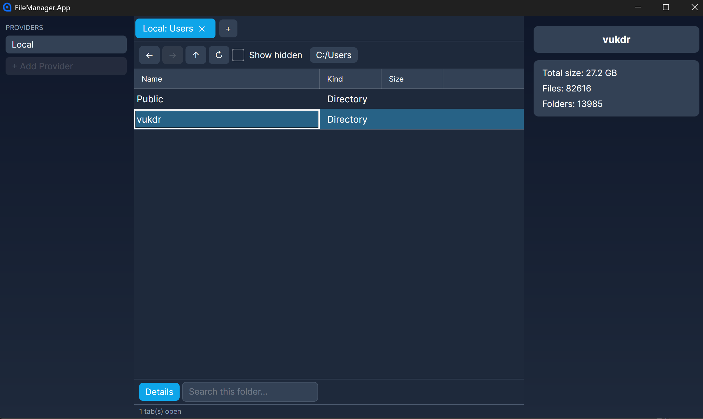
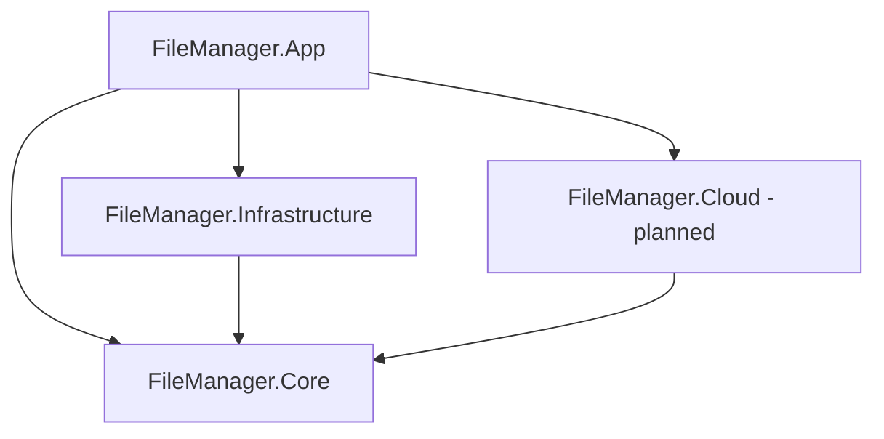

# FileManager.App

A cross-platform file manager built on Avalonia and ReactiveUI, with a
unified interface for local and cloud storage. 🚧 Active development —
see Roadmap below.



## About

This is a ground-up rewrite of a WinForms file explorer I built in high
school. The original worked, but it was tied to Windows shell APIs from
top to bottom and had no real separation between "what a file is" and
"how you get one." This version is designed around a single abstraction
— `IStorageProvider` — so the UI never has to know whether it's looking
at the local disk, Azure Blob Storage, or OneDrive.

## Why this project

A learning vehicle, deliberately:

- Async programming end-to-end — not bolted on, part of the core design
- MVVM with ReactiveUI
- Cross-platform desktop development with Avalonia
- Designing an abstraction that has to hold up against a technology
  (cloud storage) that didn't exist when the first line was written
- Docker, for running a local Azure Blob emulator during development

## Architecture

```
FileManager.sln
├── FileManager.App/                 Avalonia UI - Views, ViewModels, Converters, Services
├── FileManager.Core/                models + interfaces, zero dependencies
├── FileManager.Core.Tests/
├── FileManager.Infrastructure/      local filesystem provider
├── FileManager.Infrastructure.Tests/
└── FileManager.TestKit/             shared provider contract tests, reused by every provider's test project
```



Dependencies only point inward, toward `Core`. `Core` depends on
nothing else in the solution. `Infrastructure` (local storage), `Cloud`
(Azure/OneDrive), and a split-out `UI` project get added as their
milestones start — see Roadmap.

## Tech stack

- **.NET** — .NET 10.0
- **Avalonia UI** — cross-platform desktop UI
- **ReactiveUI** — MVVM
- **xUnit** — testing
- **Docker + Azurite** — local Azure Blob emulation for development *(planned)*

## Features so far

- Multi-tab browsing across providers, with per-tab back/forward history
- Multi-select file operations — copy, cut, paste, delete, rename
- Paste conflict resolution (skip, replace, merge, keep both — with
  "apply to all remaining conflicts")
- In-app toast notifications for success/failure feedback
- Keyboard shortcuts (Ctrl+C / Ctrl+X / Ctrl+V, Delete)
- Live folder-size and multi-selection-size calculation with progress

## Roadmap

- [x] Phase 0 — Setup & tooling
- [x] Phase 1 — Core & async basics
- [x] Phase 2 — Local storage provider
- [x] Phase 3 — UI: browsing, multi-select, notifications & dialogs
- [ ] Phase 4 — Transfer Manager
- [ ] Phase 5 — Docker & Azurite
- [ ] Phase 6 — Azure provider
- [ ] Phase 7 — Search, preview & polish

## Getting started

1. Clone the repo
2. Open `FileManager.sln` in Visual Studio (or your editor of choice)
3. Set `FileManager.App` as the startup project
4. F5 to run